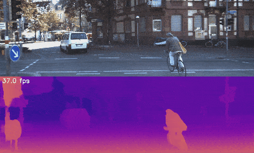

# CoEx

PyTorch implementation of our paper: 


**Correlate-and-Excite: Real-Time Stereo Matching via Guided Cost Volume Excitation**  
*Authors: Antyanta Bangunharcana, Jae Won Cho, Seokju Lee, In So Kweon, Kyung-Soo Kim, Soohyun Kim*  
IEEE/RSJ International Conference on Intelligent Robots and Systems (IROS), 2021

\[[Project page](https://antabangun.github.io/projects/CoEx/)\]

We propose a Guided Cost volume Excitation (GCE) and top-k soft-argmax disparity regression for real-time and accurate stereo matching. 

## Contents
- [Installation](#installation)
- [Datasets](#datasets)
    - [Data for demo](#data-for-demo)
    - [If you want to re-train the models](#if-you-want-to-re-train-the-models)
    - [Data directories](#data-directories)
- [Demo on KITTI raw data](#demo-on-kitti-raw-data)
    - [Model zoo](#model-zoo)
- [Re-training the model](#re-training-the-model)

## Installation

We recommend using [conda](https://www.anaconda.com/distribution/) for installation: 
```bash
conda env create -f environment.yml
conda activate coex
```

## Datasets

### Data for demo

For a demo of our code on the KITTI dataset, download the "\[synced+rectified data\]" from [raw KITTI data](http://www.cvlibs.net/datasets/kitti/raw_data.php). Unzip and place the extracted folders following the directory tree below. 
       
### If you want to re-train the models
**Sceneflow dataset**  
Download the *finalpass* data of the [Sceneflow dataset](https://lmb.informatik.uni-freiburg.de/resources/datasets/SceneFlowDatasets.en.html) as well as the *Disparity* data.

**KITTI 2015**  
Download [kitti15](http://www.cvlibs.net/datasets/kitti/eval_scene_flow.php?benchmark=stereo) dataset, and unzip data_scene_flow.zip, rename it as kitti15, and move it into SceneFlow directory as shown in the tree below.

**KITTI 2012**  
Download [kitti12](http://www.cvlibs.net/datasets/kitti/eval_stereo_flow.php?benchmark=stereo) dataset. Unzip data_stereo_flow.zip, rename it as kitti12, and move it into SceneFlow directory as shown in the tree below.

Make sure the directory names matches the tree below so that the dataloaders can locate the files.

### Data directories

In our setup, the dataset is organized as follows
```
../../data
└── datasets
    ├── KITTI_raw
    |   ├── 2011_09_26
    |   │   ├── 2011_09_26_drive_0001_sync
    |   │   ├── 2011_09_26_drive_0002_sync
    |   |       :
    |   |
    |   ├── 2011_09_28
    |   │   ├── 2011_09_28_drive_0001_sync
    |   │   └── 2011_09_28_drive_0002_sync
    |   |       :
    |   |   :    
    |
    └── SceneFlow
        ├── driving
        │   ├── disparity
        │   └── frames_finalpass
        ├── flyingthings3d_final
        │   ├── disparity
        │   └── frames_finalpass
        ├── monkaa
        │   ├── disparity
        │   └── frames_finalpass
        ├── kitti12
        │   ├── testing
        │   └── training
        └── kitti15
            ├── testing
            └── training
```

## Demo on KITTI raw data
The pretrained KITTI model is already included in './logs'.
Run
```bash
python demo.py
```
to perform stereo matching on raw kitti sequence. Here is an example result on our system with RTX 2080Ti on Ubuntu 18.04.

<p align="center">
  
</p>

For more demo results, checkout our [Project](https://antabangun.github.io/projects/CoEx/#demo) page

## Re-training the model
To re-train the model, configure './configs/stereo/cfg_yaml', e.g., batch_size, paths, device num, precision, etc. Then run
```bash
python stereo.py
```

## Citation

If you find our work useful in your research, please consider citing our paper

    @inproceedings{bangunharcana2021coex,
      title={Correlate-and-Excite: Real-Time Stereo Matching via Guided Cost Volume Excitation},
      author={Bangunharcana, Antyanta and Cho, Jae Won and Lee, Seokju and Kweon, In So and Kim, Kyung-Soo and Soohyun Kim},
      booktitle={IROS},
      year={2021}
    }

## Acknowledgements

Part of the code is adopted from previous works: [PSMNet](https://github.com/JiaRenChang/PSMNet), [AANet](https://github.com/haofeixu/aanet), [GANet](https://github.com/feihuzhang/GANet), [SpixelFCN](https://github.com/fuy34/superpixel_fcn)
